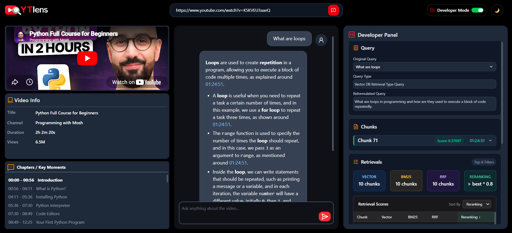
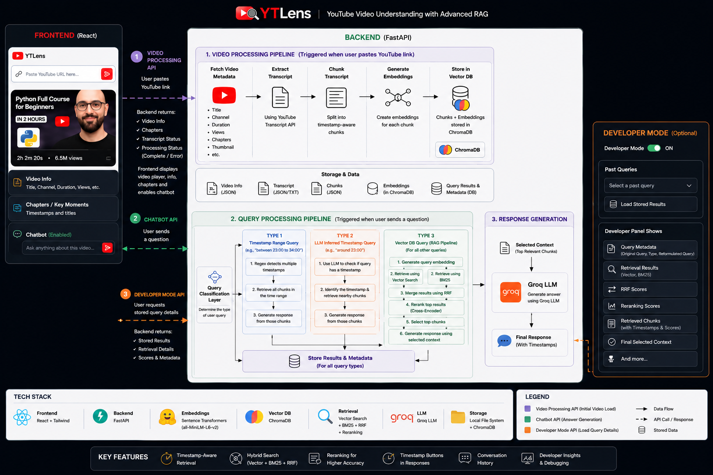

# 🎥 YTLens


YTLens is an AI-powered YouTube chatbot that enables users to interact with YouTube videos through natural language. Simply paste a YouTube video URL, and YTLens processes the video transcript, builds a Retrieval-Augmented Generation (RAG) pipeline, and allows users to ask questions about the video's content.

Instead of manually searching through long videos, users can instantly retrieve relevant information, summaries, explanations, and timestamps through a conversational interface.

> YTLens combines transcript processing, hybrid retrieval (Vector Search + BM25), Reciprocal Rank Fusion (RRF), and Cross-Encoder Reranking to deliver accurate, context-aware answers grounded in YouTube video content.


---
## 📸 Application Preview




---
## 🚀 Features

### 💬 Chat with YouTube Videos

* Paste any YouTube video URL.
* Automatically extracts and processes video transcripts.
* Ask questions in natural language.
* Get context-aware answers grounded in the video content.

### 🎥 Integrated Video Experience

* Embedded YouTube player.
* Video metadata extraction.
* Transcript-aware question answering.
* Interactive video exploration.

### 🔍 Advanced Hybrid Retrieval Pipeline

YTLens combines multiple retrieval strategies to improve answer quality:

* Semantic Vector Search
* BM25 Keyword Search
* Reciprocal Rank Fusion (RRF)
* Cross-Encoder Reranking

This hybrid retrieval approach improves answer accuracy by combining both semantic understanding and keyword matching.

### 📚 Context-Aware Responses

* Retrieves the most relevant transcript chunks.
* Uses retrieved context to generate grounded responses.
* Reduces hallucinations through retrieval-based generation.

### 🛠️ Developer Mode

Built-in observability dashboard for understanding retrieval behavior.

* Query Information
* Retrieved Chunks
* Retrieval Scores
* Chunk Rankings
* Vector Retrieval Results
* BM25 Retrieval Results
* RRF Rankings
* Reranking Results
* Retrieval Parameters
* Retrieval Thresholds

This makes debugging and retrieval optimization significantly easier.

### ⚡ Interactive UI

* Modern chat interface
* Embedded Youtube Player
* Retrieval analytics dashboard
* Real-time query processing
* Dark mode support

---
## 🧠 Query Processing Workflows

YTLens uses multiple query processing workflows to handle different types of user questions efficiently. Instead of sending every query through the same retrieval pipeline, the system first identifies the query type and routes it to the most appropriate workflow.
```text
                User Query
                     │
                     ▼
             Query Analyzer
                     │
        ┌────────────┼────────────┐
        ▼            ▼            ▼
     Timestamp    Timestamp     Semantic
       Range       Intent       Retrieval
      Workflow     Workflow      Workflow
```

### 1. Timestamp Range Workflow

Handles queries that explicitly specify a timestamp range.

**Examples**

```text
What is explained between 25:00 and 28:00?

Summarize the discussion from 12:30 to 15:45.
```

**How it works**

* Uses regex-based timestamp extraction.
* Identifies the requested time interval.
* Retrieves transcript chunks only from the specified range.
* Generates a response from the filtered content.

---

### 2. Timestamp Intent Workflow

Handles queries that reference a timestamp without specifying an exact range.

**Examples**

```text
What is discussed around 25:00?

Explain the topic mentioned near 18:30.

What happens at 42:15?
```

**How it works**

* Uses an LLM-based query analyzer.
* Detects timestamp-related intent.
* Extracts the timestamp from the query.
* Dynamically retrieves transcript chunks surrounding the detected timestamp.
* Generates a context-aware answer.

---

### 3. Semantic Retrieval Workflow

Handles general content-based questions.

**Examples**

```text
What are the main takeaways from the video?

Explain transformers discussed in the video.

What are the advantages mentioned by the speaker?
```

**How it works**

* Hybrid Retrieval (Vector Search + BM25)
* Reciprocal Rank Fusion (RRF)
* Cross-Encoder Reranking
* Context Selection
* LLM Response Generation

This workflow is used for the majority of user questions.


---

## 🏗️ System Architecture



---

## 🛠️ Tech Stack

### Frontend
* React
* Vite
* Tailwind CSS
* YouTube IFrame Player API (embedded video playback)

### Backend
* Python
* LangChain
* FastAPI

### YouTube Integration
* YouTube Transcript API for transcript extraction
* yt-dlp for video metadata retrieval
* YouTube IFrame Player for synchronized video playback

### Retrieval

* Vector Search
* BM25
* Reciprocal Rank Fusion (RRF)
* Cross-Encoder Reranking

### AI Components

* Embeddings Model - Hugging Face (BAAI/bge-small-en)
* Large Language Model (LLM) - Grok (llama-3.3-70b-versatile)


---
## 📂 Project Structure

```text
YTLens
├── frontend
│   └── src
│       ├── components
│       ├── context
│       └── helpers
│
├── backend
│   ├── app
│   │   ├── api
│   │   ├── core
│   │   ├── models
│   │   ├── services
│   │   ├── utils
│   │   └── main.py
│   ├── data
│   └── venv
│
├── images
│
└── README.md
```


---
## ⚙️ Installation

### Clone Repository

```bash
git clone https://github.com/shubhamkgarg06/YTLens.git
cd YTLens
```

### Backend Setup

```bash
cd backend
pip install -r requirements.txt
```

Create a `.env` file and add your API keys.

```env
GROQ_API_KEY=your_key
HUGGINGFACE_API_KEY=your_key
```

Run backend:

```bash
uvicorn app.api.main:app --reload
```

### Frontend Setup

```bash
cd frontend

npm install
npm run dev
```

---

## 🎯 Example Usage

1. Paste a YouTube URL.
2. Wait for transcript processing.
3. Ask questions such as:

```text
What are the key points discussed in this video?

Can you summarize the video?

What does the speaker say about transformers?

Explain the concept discussed at the beginning of the video.
```

---

## 🔬 Retrieval Pipeline

YTLens uses a multi-stage retrieval architecture

### Why Hybrid Retrieval?

Vector retrieval captures semantic meaning but may miss exact keyword matches.

BM25 captures exact terminology but lacks semantic understanding.

Combining both through Reciprocal Rank Fusion provides stronger retrieval performance than either method alone.


### 1. Vector Retrieval

Performs semantic similarity search using embeddings.

### 2. BM25 Retrieval

Performs keyword-based retrieval to capture exact term matches.

### 3. Reciprocal Rank Fusion (RRF)

Combines rankings from multiple retrieval strategies.

### 4. Cross-Encoder Reranking

Reorders retrieved chunks based on relevance to the user query.

### 5. Context Generation

Top-ranked chunks are passed to the LLM for answer generation.

---

## 🔮 Future Improvements

* Multi-video knowledge base
* Video summarization
* Chat history persistence
* Source citations
* Retrieval analytics enhancements
* User Authentication
* Multi-language support

---


